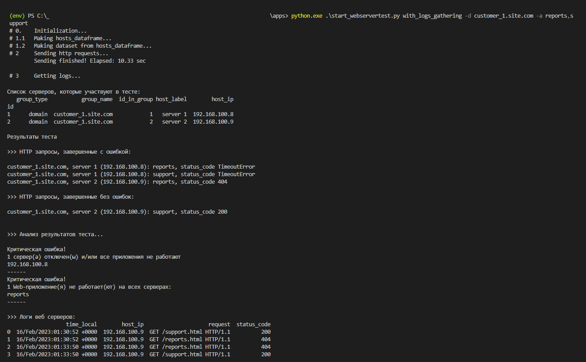

#  webserver-test

## Оглавление
- [Краткое описание](#описание)
- [Задачи проекта](#задачи)
- [Описание логики основных функций](#логика)
- [Начальная установка и запуск](#установка)
- [Запуск тестов pytest](#тесты)
 
 

 
## Краткое описание основного функционала

webserver-test - проект для моего портфолио по разработке на Python.
 В проекте я показал несколько задач из области инфрастуктурной автоматизации и как я реализовал их решение.
 Задачи приблежены к тем, которые я решаю на текущем месте работы.
 Проект можно отнести к классу OAM tools для системных инженеров и отдела поддержки.

Ядро проекта - классы CommonWebSrvTest, WebSrvTestWithLogs, WebSrvTestWithAlerts

Основной функционал:
- отправка HTTP запросов по списку URL
- обработка кодов ответа
- сбор логов с веб серверов
- отправка результата теста и логов на email

P.S. Название сервисов, тестовых страниц, клиентов приведены только для демонстрации функционала проекта и не связаны с продакшеном моей фирмы

 

## Задачи проекта

Моя фирма подключает и настривает сервера по всему миру.
 Несколько тысяч серверов и виртуальных машин, несколько тысяч клиентов.
 Веб-сервер и веб сервис в этом проекте представлены для демонстрации.

Веб-сервис клиента развернут на нескольких серверах для балансировки нагрузки и резервирования.
 Система мониторинга (Icinga, Zabbix, Prometheus и т.д.) регистрируют события отдельного сервера.
 На уровне nginx проверяется доступность порта 80/443, на уровне сервера проверяется ping и т.д.
 

### Задача 1. Автоматизация проверки качества веб сервисов в случае аварийных оповещений

В нашей системе мониторинга события из Icinga/Zabbix/Prometheus не агрегированы по клиентам и сервисам.
 Для проверки измений качества веб сервисов клиентов приходится тратить время на сбор, группировку, обобщение данных.

Пример: Icinga показывает, что 10 серверов отключились, и WEB сервис перестал работать.
 Что это значит? Затронет ли это клиента А или клиента Б? Критическое это отключение или нет?
 Как реагировать группе мониторинга и т.д.

С помощью проверки WEB сервисов по всем клиентам можно проверить, какие изменения произошли.

### Задача 2.1. Мониторинг качества сервиса на разных серверах, для разных клиентов

### Задача 2.2. Мониторинг качества сервисов одного клиента

Необходимость таких проверок возникает:
- по запросу клиента в отдел поддержки (если клиент наблюдает ухудшение качества)
- во время планового обновления софта на для сервисов конкретного клиента или для конкретныз сервисов всех клиентов

Базовый класс webserver-test выполняет тестирование WEB сервисов в группе серверов клиентов, агрегирует результат про группе серверов/сервису
 Расширенный класс собирает логи с веб серверов, выдает отчет с результами на email и skype в зависимости от уровня критичности вывленных ошибок.
 Тестирование выполняется с помощью асинхронной отправки http запроса на тестовую страницу сервиса.

 

## Описание логики основных функций

Базовый и расширенные классы для выполнения тестирование WEB сервисов находятся в .\apps\webserver_test\core\webserver_test.py

### CommonWebSrvTest
Выполняет запуск http запросов на url, которые формируются из списка хостов и сервисов

- CommonWebSrvTest при инициализации принимает host_groups, services, rqst_stngs
    - host_groups принимает список доменных имен которые представлят группу серверов одного или несколькиз клиентов.
      Пример: 
    ~~~~~~~~~~~~~~~~~~~~~~~~~~~~~~~~~~~~~~~~~~~~~~~~~~~~~~~~~~~~~~~~~~~~~~~~~~~~~~~~
    host_groups = ['customer_1.site.com', 'customer_2.site.com']
    ~~~~~~~~~~~~~~~~~~~~~~~~~~~~~~~~~~~~~~~~~~~~~~~~~~~~~~~~~~~~~~~~~~~~~~~~~~~~~~~~

    - services - список WEB сервисов (приложений) для тестирования.
      Может быть словарем, где ключ - домен (т.е. для каждого домена может быть отдельный список сервисов)
      Пример: 
    ~~~~~~~~~~~~~~~~~~~~~~~~~~~~~~~~~~~~~~~~~~~~~~~~~~~~~~~~~~~~~~~~~~~~~~~~~~~~~~~~
    services = {'customer_1.site.com': ["reports", "support"], 'customer_1.site.com': ["analytics", "store"]}
    ~~~~~~~~~~~~~~~~~~~~~~~~~~~~~~~~~~~~~~~~~~~~~~~~~~~~~~~~~~~~~~~~~~~~~~~~~~~~~~~~

    - rqst_stngs - настройки для http сессий: timeout (секунд) и max_retries
      Пример: 
    ~~~~~~~~~~~~~~~~~~~~~~~~~~~~~~~~~~~~~~~~~~~~~~~~~~~~~~~~~~~~~~~~~~~~~~~~~~~~~~~~
    rqst_stngs = {"timeout": 10, "max_retries": 0}
    ~~~~~~~~~~~~~~~~~~~~~~~~~~~~~~~~~~~~~~~~~~~~~~~~~~~~~~~~~~~~~~~~~~~~~~~~~~~~~~~~

- Метод .run() выполняет запуск тестирования 
  Основные вызовы функций внутри self.run():
    - self._data_compilation() - выполняет компиляцию датасета из host_groups и services.
        - Запускает nslookup для списка доменных имен
        - Итерирует список хостов по списку приложений, формирутся список URL для отправки http запросов
        - Формирует pandas dataframe для удобного хранения исходных данных и добавления результов отправки http запросов
    
    - self._run_websrvtest_tasks() - отправляет http запросы в асинхронном режиме и добавляет результаты к dataset
        - Результат обработки http ответа: [status_code, resp_out, exception_request, tries]
        - join_testresult_dataset() обьединяет результат и dataset
        - self.rqsts_df хранит обьединенные результаты в виде pandas DataFrame
        - self.errors - pandas DataFrame со списком результатов с http кодом != 200 (или которые завершились c Exception)
        - self.no_errors - pandas DataFrame со список результатов с http кодом == 200
    
    - self._make_txt_summary() - формирует словарь txt_summary с текстовыми результатами (с ошибкам, без ошибок и общиий)

- Метод .analyze() выполняет запуск обработку результатов тестирования http сервисов
  Основные вызовы функций вниутри self.analyze():
    - вызов класса WtestAnalyzer для группровки  результатов по списку хостов и сервисов
        - WtestAnalyzer находит хосты, на которых не работают все сервисы (http запросы без кода 200)
        - WtestAnalyzer находит сервисы, которые не работают на всех хостах (http запросы без кода 200)
        - WtestAnalyzer по err_threshold находит сервисы, уровень ошибок которых выше err_threshold
        - Итерирует список хостов по списку приложений, формирутся список URL для отправки http запросов
        - Формирует pandas dataframe для удобного хранения исходных данных и добавления результов отправки http запросов
    
    - self.findings хранит текстовый результат анализа
    
  
### WebSrvTestWithLogs
Выполняет запуск http запросов и собирает логи с тех серверов, ответы от которых пришли с ошибками

- WebSrvTestWithLogs наследуется от CommonWebSrvTest, при инициализации дополнительно принимает err_threshold и key
    - key - путь к приватному ключу для поключения по ssh
    - err_threshold - для поиска сервисов, уровень ошибок которых выше err_threshold
    
- .run() выполняет логику родительского класса, выполняет self.analyze() и добавлет метод self._get_logs()
    - self._get_logs() запускает LogsCollectorAfterTest
    - ._data_compilation() сборщика логов формирует список команд для покдлючения по ssh
    - asyncio.run сборщика логов запускает подключение по ssh в асинхронном режиме
    - собранные логи хранятся в виде списке pandas DataFrame
  
 - self.logs хранит обьект класса WebServerLogs, self.logs.raw - список pandas DataFrame-ов
 
 
 ### WebSrvTestWithAlerts
Выполняет запуск http запросов, собирает логи WEB серверов, отправляет отчет с ошибками и логами

- .init() дополнительно к параметрам родительского классса принимает auth, to_list, subject
    - auth - username, passwd, server для авторизации на mail сервере
    - to_list - список email адресов, на которые нужно отправить отчет и логи
    - subject - тема письма
- .run() выполняет логику родительского класса WebSrvTestWithLogs
- Метод .sendmail() реализует отправку отчета с ошибками и логами

## Начальная установка и запуск

- 1 Склонируйте репозитарий, активируйте virtual env (если необходимо), установите зависимости и модули

~~~~~~~~~~~~~~~~~~~~~~~~~~~~~~~~~~~~~~~~~~~~~~~~~~~~~~~~~~~~~~~~~~~~~~~~~~~~~~~~
git clone https://github.com/bbossankimster/webserver-test.git
pip install -r requirements.txt
~~~~~~~~~~~~~~~~~~~~~~~~~~~~~~~~~~~~~~~~~~~~~~~~~~~~~~~~~~~~~~~~~~~~~~~~~~~~~~~~

- 2 Запуск проверки WEB серверов выполнятся из start_webservertest.py

~~~~~~~~~~~~~~~~~~~~~~~~~~~~~~~~~~~~~~~~~~~~~~~~~~~~~~~~~~~~~~~~~~~~~~~~~~~~~~~~
cd .\apps\ 

python.exe .\start_webservertest.py -h
usage: start_webservertest.py [-h] [-d HOST_DOMAINS] [-a WEB_APPLICATIONS] [-t ERR_THRESHOLD] [-e SEND_ERRORS_TO] [-n SEND_NO_ERRORS_TO] [-u]
                              {simple,with_logs_gathering,with_alerts_sending}
~~~~~~~~~~~~~~~~~~~~~~~~~~~~~~~~~~~~~~~~~~~~~~~~~~~~~~~~~~~~~~~~~~~~~~~~~~~~~~~~

- 2.1 Пример: запуск простой http проверки (без сбора логов и отправки отчета)

~~~~~~~~~~~~~~~~~~~~~~~~~~~~~~~~~~~~~~~~~~~~~~~~~~~~~~~~~~~~~~~~~~~~~~~~~~~~~~~~
python.exe .\start_webservertest.py simple -d customer_1.site.com -a reports,support
~~~~~~~~~~~~~~~~~~~~~~~~~~~~~~~~~~~~~~~~~~~~~~~~~~~~~~~~~~~~~~~~~~~~~~~~~~~~~~~~
    - 100% ошибок
    

    - часть с ошибками, часть без ошибок
    
    
2.2 Пример: запуск http проверки со сбором логов

~~~~~~~~~~~~~~~~~~~~~~~~~~~~~~~~~~~~~~~~~~~~~~~~~~~~~~~~~~~~~~~~~~~~~~~~~~~~~~~~
python.exe .\start_webservertest.py with_logs_gathering -d customer_1.site.com -a reports,support
~~~~~~~~~~~~~~~~~~~~~~~~~~~~~~~~~~~~~~~~~~~~~~~~~~~~~~~~~~~~~~~~~~~~~~~~~~~~~~~~

    - Результат выполнения
    

- 2.3 Пример: запуск http проверки со сбором логов и отправкой отчета на email

~~~~~~~~~~~~~~~~~~~~~~~~~~~~~~~~~~~~~~~~~~~~~~~~~~~~~~~~~~~~~~~~~~~~~~~~~~~~~~~~
python.exe .\start_webservertest.py with_alerts_sending -d customer_1.site.com -a reports,support
~~~~~~~~~~~~~~~~~~~~~~~~~~~~~~~~~~~~~~~~~~~~~~~~~~~~~~~~~~~~~~~~~~~~~~~~~~~~~~~~

    - Результаты отправки отчета на email
    
    
    
    
    

 

## Запуск тестов pytest

~~~~~~~~~~~~~~~~~~~~~~~~~~~~~~~~~~~~~~~~~~~~~~~~~~~~~~~~~~~~~~~~~~~~~~~~~~~~~~~~
pytest.exe .\tests\
~~~~~~~~~~~~~~~~~~~~~~~~~~~~~~~~~~~~~~~~~~~~~~~~~~~~~~~~~~~~~~~~~~~~~~~~~~~~~~~~

