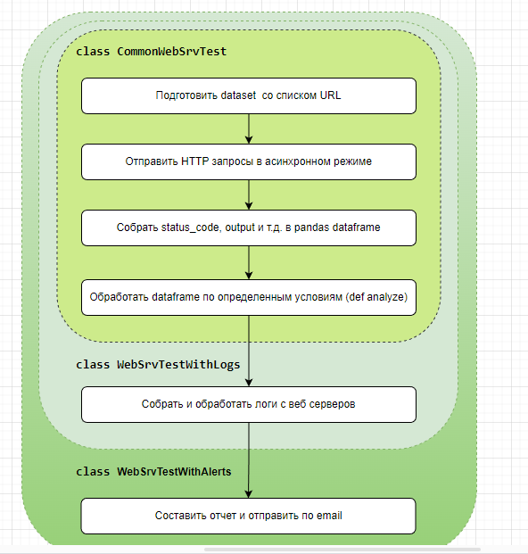

#  webserver-test

## Краткое описание основного функционала

webserver-test - проект для моего портфолио по разработке на Python.
 В проекте я показал несколько задач из области инфрастуктурной автоматизации и как я реализовал их решение.
 Задачи приблежены к тем, которые я решаю на текущем месте работы.
 Проект можно отнести к классу OAM tools для системных инженеров и отдела поддержки.

Ядро проекта - классы CommonWebSrvTest, WebSrvTestWithLogs, WebSrvTestWithAlerts

Основной функционал:
- отправка HTTP запросов по списку URL
- обработка кодов ответа
- сбор логов с веб серверов
- отправка результата теста и логов на email

P.S. Название сервисов, тестовых страниц, клиентов приведены только для демонстрации функционала проекта и не связаны с продакшеном моей фирмы

## Задачи проекта

Моя фирма подключает и настривает сервера по всему миру.
 Несколько тысяч серверов и виртуальных машин, несколько тысяч клиентов.
 Веб-сервер и веб сервис в этом проекте представлены для демонстрации.

Веб-сервис клиента развернут на нескольких серверах для балансировки нагрузки и резервирования.
 Система мониторинга (Icinga, Zabbix, Prometheus и т.д.) регистрируют события отдельного сервера.
 На уровне nginx проверяется доступность порта 80/443, на уровне сервера проверяется ping и т.д.
 

### Задача 1. Автоматизация проверки качества веб сервисов в случае аварийных оповещений

В нашей системе мониторинга события из Icinga/Zabbix/Prometheus не агрегированы по клиентам и сервисам.
 Для проверки измений качества веб сервисов клиентов приходится тратить время на сбор, группировку, обобщение данных.

Пример: Icinga показывает, что 10 серверов отключились, и WEB сервис перестал работать.
 Что это значит? Затронет ли это клиента А или клиента Б? Критическое это отключение или нет?
 Как реагировать группе мониторинга и т.д.

С помощью проверки WEB сервисов по всем клиентам можно проверить, какие изменения произошли.

### Задача 2.1. Мониторинг качества сервиса на разных серверах, для разных клиентов

### Задача 2.2. Мониторинг качества сервисов одного клиента

Необходимость таких проверок возникает:
- по запросу клиента в отдел поддержки (если клиент наблюдает ухудшение качества)
- во время планового обновления софта на для сервисов конкретного клиента или для конкретныз сервисов всех клиентов

Базовый класс webserver-test выполняет тестирование WEB сервисов в группе серверов клиентов, агрегирует результат про группе серверов/сервису
 Расширенный класс собирает логи с веб серверов, выдает отчет с результами на email и skype в зависимости от уровня критичности вывленных ошибок.
 Тестирование выполняется с помощью асинхронной отправки http запроса на тестовую страницу сервиса.

